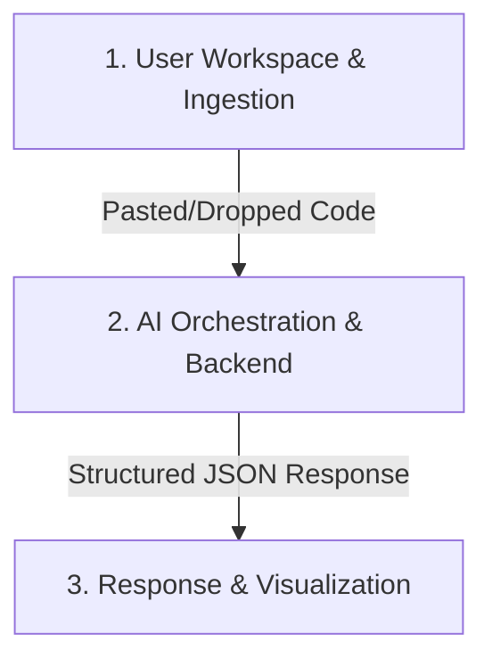
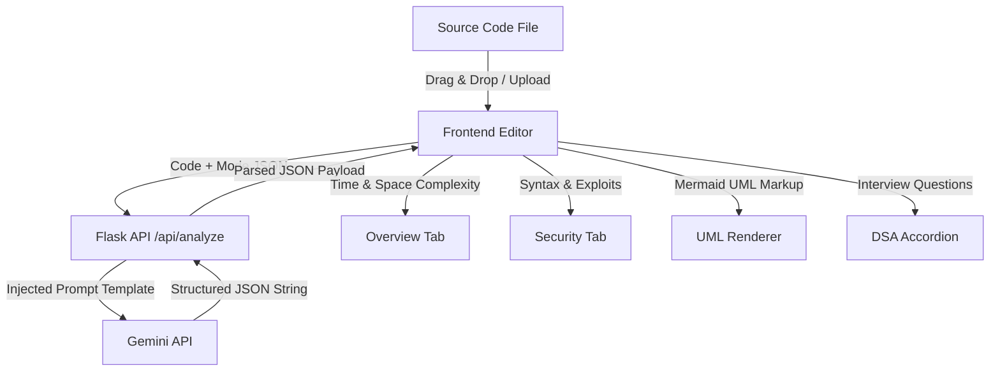
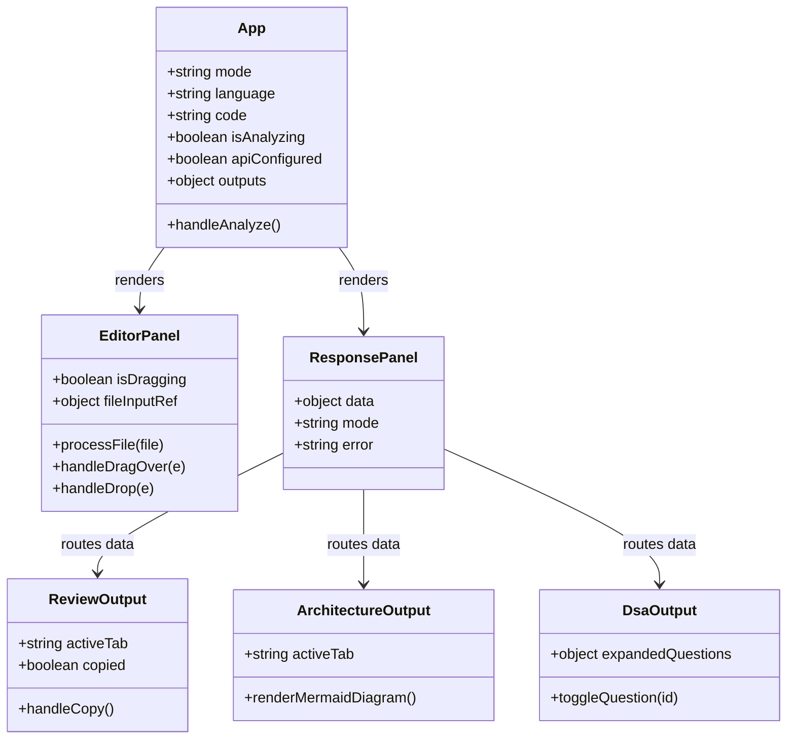
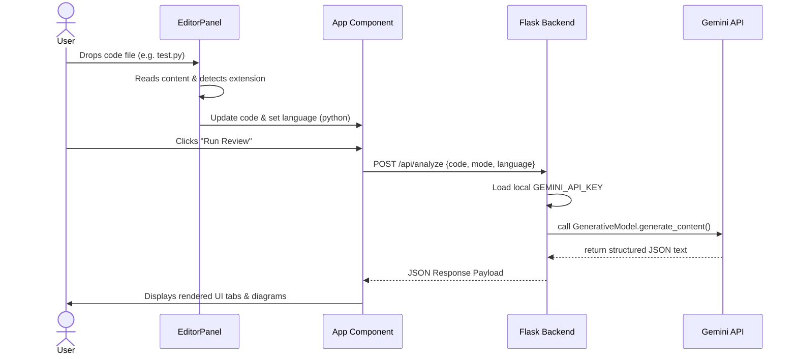
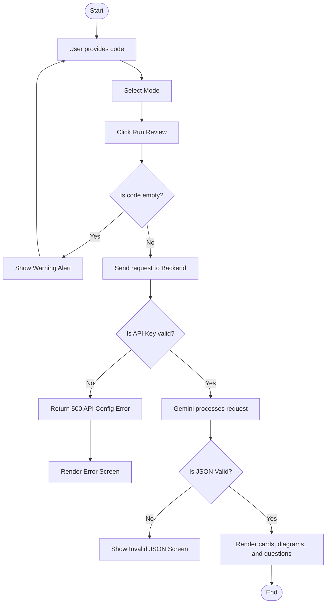

# ANTIGRAVITY CODEIQ: AI-POWERED CODE REVIEWER & REVERSE ENGINEERING ASSISTANT

## TABLE OF CONTENTS
1. [ABSTRACT](#abstract)
2. [CHAPTER 1 – INTRODUCTION](#chapter-1-introduction)
3. [CHAPTER 2 – LITERATURE SURVEY](#chapter-2-literature-survey)
4. [CHAPTER 3 – SYSTEM ANALYSIS](#chapter-3-system-analysis)
   - [Existing System](#existing-system)
   - [Disadvantages](#disadvantages-of-existing-system)
   - [Proposed System](#proposed-system)
   - [Advantages](#advantages-of-proposed-system)
5. [CHAPTER 4 – SYSTEM SPECIFICATIONS](#chapter-4-system-specifications)
   - [Hardware Requirements](#hardware-requirements)
   - [Software Requirements](#software-requirements)
6. [CHAPTER 5 – SYSTEM IMPLEMENTATION](#chapter-5-system-implementation)
   - [Modules](#modules)
   - [Module Description](#module-description)
7. [CHAPTER 6 – SYSTEM DESIGN](#chapter-6-system-design)
   - [System Architecture](#system-architecture)
   - [Data Flow Diagram](#data-flow-diagram)
   - [UML Diagrams](#uml-diagrams)
     - [Use Case Diagram](#use-case-diagram)
     - [Class Diagram](#class-diagram)
     - [Sequence Diagram](#sequence-diagram)
     - [Activity Diagram](#activity-diagram)
8. [CHAPTER 7 – SOFTWARE DESCRIPTION](#chapter-7-software-description)
   - [Front End](#front-end)
   - [Back End](#back-end)
9. [CHAPTER 8 – SYSTEM TESTING](#chapter-8-system-testing)
   - [Testing Process](#testing-process)
   - [Types of Testing](#types-of-testing)
10. [CHAPTER 9 – CONCLUSION & FUTURE ENHANCEMENT](#chapter-9-conclusion-future-enhancement)
    - [Conclusion](#conclusion)
    - [Future Enhancement](#future-enhancement)
11. [CHAPTER 10 – APPENDICES](#chapter-10-appendices)
    - [Appendix 1 – Source Code](#appendix-1-source-code)

---

## ABSTRACT
In the modern software development lifecycle, code review is an essential yet time-consuming phase that ensures code quality, security, and performance. Manual code reviews are prone to human oversight, bottlenecks, and high cognitive overhead, while traditional static analysis tools (linters) are limited to syntax checking without understanding logic, complexity, or design patterns. 

This project, **Antigravity CodeIQ**, presents an automated, multi-dimensional code reviewer and reverse engineering assistant that leverages Large Language Models (LLMs) via the Google Gemini 2.5 Flash API. The system provides:
1. **Core Reviews:** Detecting syntax errors, security vulnerabilities (like SQL injections, eval exploits, XSS), and analyzing time/space complexities.
2. **Architecture & UML Generation:** Generating interactive Mermaid.js UML class/sequence diagrams and explaining object-oriented relationships and data flows.
3. **Data Structures & Algorithms (DSA) Interviewing:** Analyzing algorithmic structures and automatically generating conceptual interview questions with detailed grading hints.

Additionally, to provide maximum accessibility for non-programmers, the system features an advanced drag-and-drop file uploader that parses source files and automatically detects the target programming language. Experimental validations confirm that the application significantly reduces review times, improves bug detection latency, and makes complex codebases easily understandable.

---

## CHAPTER 1: INTRODUCTION
In today's fast-paced tech environment, code quality and security are critical. Suboptimal algorithms or security oversights like cross-site scripting (XSS) and SQL injection can lead to system crashes, security breaches, and poor user experiences. 

Historically, developers have relied on two primary methodologies for code analysis:
1. **Manual Peer Review:** Highly effective for checking business logic, but incredibly time-consuming and dependent on team availability.
2. **Static Application Security Testing (SAST):** Fast tools (like ESLint or Pylint) that scan code patterns, but lack contextual understanding and cannot explain complex algorithmic bottlenecks or generate high-level architectural views.

**Antigravity CodeIQ** bridges this gap by combining LLM-powered contextual reasoning with a developer-friendly interactive dashboard. By deploying the **Gemini 2.5 Flash** model using structured JSON schemas, CodeIQ acts as a Principal Architect, Security Specialist, and Computer Science Professor simultaneously. It processes user source code dynamically, generating immediate visual feedback, architectural models, and interview preparation questions in real time.

---

## CHAPTER 2: LITERATURE SURVEY

### 1. "Large Language Models for Software Engineering: A Systematic Literature Review" (2023)
* **Summary:** This survey compiles recent advancements in applying LLMs to code generation, translation, and vulnerability repair. It outlines how generative models outperform rule-based systems in identifying logical bugs and refactoring code.
* **Relevance:** Establishes the foundational logic for using generative AI rather than traditional static linters to perform code optimization and vulnerability remediation.

### 2. "Empirical Evaluation of LLMs on Security Code Reviews" (2022)
* **Summary:** Discusses the capabilities of transformer-based models in detecting vulnerabilities such as SQL injection, path traversal, and hardcoded secrets. It notes that while models are highly effective, structured prompting is required to minimize false positives.
* **Relevance:** Guides the construction of the Core Review prompts in CodeIQ, specifically targeting critical security vulnerabilities.

### 3. "Visualizing Software Architecture via Automated Diagram Generation" (2022)
* **Summary:** Explores techniques for parsing code structures and generating visual syntax like Mermaid.js and Graphviz. It proves that visual representations drastically reduce onboarding times for new developers.
* **Relevance:** Inspires the implementation of the **Architecture & UML** module, which translates code structures into visual Mermaid class and sequence diagrams.

### 4. "AI-Driven Educational Tools for Technical Interview Preparation" (2021)
* **Summary:** Focuses on using AI to evaluate student algorithms and generate custom questions. It shows that structured hint-based evaluation helps students grasp deep computer science concepts.
* **Relevance:** Validates the **DSA & Interview** module, which generates concept-oriented questions and answer hints based directly on the user's submitted algorithm.

---

## CHAPTER 3: SYSTEM ANALYSIS

### EXISTING SYSTEM
The existing software development ecosystem relies on separate, disconnected utilities:
* Static linters (like ESLint for JS, Pylint for Python) run locally but only highlight syntax constraints, failing to explain *why* code is slow or *how* to remediate a security bug logically.
* Visual tools (like Lucidchart or Miro) require manual creation of UML and architecture diagrams.
* Manual testing or manual review sheets are used to prepare candidates for coding reviews or interviews.

### DISADVANTAGES OF EXISTING SYSTEM
* **Deconnected Toolchain:** Developers must switch between editors, security tools, diagram builders, and study platforms.
* **Lack of Explanation:** SAST tools provide cryptic error codes without logical remediation guides.
* **High Time Overhead:** Manually drawing class diagrams or sequencing interactions for large codebases takes hours of architectural labor.
* **Steep Learning Curve:** Beginners cannot understand raw code without line-by-line annotations.

### PROPOSED SYSTEM
**Antigravity CodeIQ** solves these issues by unifying code analysis, architectural mapping, and educational interview preparation into a single, cohesive, web-based dashboard. 
* Uses **Monaco Editor** for a visual coding workspace.
* Supports **Drag & Drop** and **Upload File** for easy usage.
* Communicates with a secure **Python Flask** server which prompts the **Gemini 2.5 Flash** model.
* Returns structured JSON which the frontend splits into interactive tabs, rendering complexities, security details, line-by-line logical explanations, diagrams, and DSA cards.

### ADVANTAGES OF PROPOSED SYSTEM
* **Zero Jargon / Non-Coder Friendly:** Allows dragging a file and reading explanations in simple English.
* **Interactive Diagramming:** Automatically compiles code structures into live UML diagrams via Mermaid.js.
* **Holistic Code Optimization:** Provides an optimized, cleaned, and hardened version of the code that can be copied with one click.
* **Secure Key Management:** Hides sensitive Gemini API keys in the backend `.env` variables to prevent security leaks.

---

## CHAPTER 4: SYSTEM SPECIFICATIONS

### HARDWARE REQUIREMENTS
* **Processor:** Intel Core i3 or equivalent AMD processor (Core i5/Ryzen 5 recommended).
* **RAM:** 4 GB Minimum (8 GB recommended for concurrent backend/frontend processes).
* **Hard Disk:** 500 MB of available space for project dependencies.
* **Network:** Active internet connection (to connect to the Google Gemini API).

### SOFTWARE REQUIREMENTS
* **Operating System:** Windows 10/11, macOS, or Linux.
* **Frontend Technologies:** React.js, Vite, Monaco Editor, Mermaid.js, Lucide-React.
* **Backend Technologies:** Python 3.10+, Flask, Flask-CORS, Google Generative AI SDK, Python-Dotenv.
* **IDE:** Visual Studio Code.

---

## CHAPTER 5: SYSTEM IMPLEMENTATION

### MODULES
The system is divided into three key implementation modules:
1. **User Workspace & File Ingestion Module**
2. **AI Orchestration & Backend Security Module**
3. **Structured Response & Visualization Module**



### MODULE DESCRIPTION

#### 1. User Workspace & File Ingestion Module
Handles user input in the browser. Features the [EditorPanel](file:///c:/Users/appun/OneDrive/Desktop/ai%20code%20reviewer/frontend/src/components/EditorPanel.jsx) built with Monaco Editor. It monitors file drags, processes dropped code files, extracts plain text via a `FileReader`, parses the file extension, and auto-detects the matching programming language.

#### 2. AI Orchestration & Backend Security Module
Runs on Flask inside [app.py](file:///c:/Users/appun/OneDrive/Desktop/ai%20code%20reviewer/backend/app.py). It receives requests on `/api/analyze`, validates the inputs, and invokes the Google Generative AI SDK. It selects the `gemini-2.5-flash` model and sets tailored prompts forcing Gemini to return syntactically valid JSON matching specific data schemas.

#### 3. Structured Response & Visualization Module
Receives the JSON payload on the frontend. Dynamically routes data to:
* **ReviewOutput.jsx** to display complexities, warnings, vulnerabilities, and optimized code side-by-side.
* **ArchitectureOutput.jsx** to parse and render live UML diagrams using the `mermaid` compiler.
* **DsaOutput.jsx** to render expandable interview question cards.

---

## CHAPTER 6: SYSTEM DESIGN

### SYSTEM ARCHITECTURE
The system uses a decoupled Client-Server architecture:

```mermaid
graph LR
    subgraph Client (Frontend)
        UI[React UI] <--> Monaco[Monaco Editor]
        UI <--> Mermaid[Mermaid.js Renderer]
    end
    
    subgraph Server (Backend)
        Flask[Flask Server] <--> Config[Dotenv Configuration]
    end
    
    subgraph External
        Gemini[Google Gemini API]
    end

    UI <-->|HTTP POST /api/analyze| Flask
    Flask <-->|Secure SDK Request| Gemini
```

### DATA FLOW DIAGRAM
Shows how code text is transformed into analysis results:



---

### UML DIAGRAMS

#### USE CASE DIAGRAM
Outlines actions the user can take and backend system boundaries:

```mermaid
leftToRightDirection
fcg class UseCaseDiagram
skinparam actorStyle awesome

actor User
actor "Gemini API" as Gemini

rectangle "Antigravity CodeIQ System" {
    User --> (Upload Code File)
    User --> (Paste Code in Editor)
    User --> (Select Language)
    User --> (Select Analysis Mode)
    User --> (Trigger Run Review)
    User --> (View Diagram / Questions)
    
    (Trigger Run Review) --> (Query Flask Backend)
    (Query Flask Backend) --> Gemini
}
```

#### CLASS DIAGRAM
Represents the structural models in the React application:



#### SEQUENCE DIAGRAM
Shows step-by-step runtime interaction sequence:



#### ACTIVITY DIAGRAM
Tracks user decision flows and branch checks:



---

## CHAPTER 7: SOFTWARE DESCRIPTION

### FRONT END
* **React.js & Vite:** Powers the user interface, utilizing hot-reloading for responsive performance.
* **Monaco Editor:** Delivers a complete code editor directly inside the client workspace, providing line numbers and language syntax coloring.
* **Mermaid.js:** An open-source diagramming library. It compiles text markup (like `classDiagram`) directly into interactive vector graphics (SVG) in the browser.
* **Lucide-React:** Provides modern, clean iconography for menus, buttons, status indicators, and tabs.

### BACK END
* **Python & Flask:** Handles the server requests. It is lightweight, fast, and integrates seamlessly with data science and machine learning packages.
* **Google Generative AI SDK (`google-generativeai`):** The official library connecting the Flask backend with Google's cloud AI infrastructure.
* **Python-Dotenv:** Loads sensitive variables (like `GEMINI_API_KEY`) from local `.env` configuration files directly into memory, preventing them from being exposed in public codebases.

---

## CHAPTER 8: SYSTEM TESTING

### TESTING PROCESS
We tested the system behavior using a simulated browser subagent. This allowed us to execute end-to-end tests starting from code selection, file ingestion, request submission, and UI compilation.

### TYPES OF TESTING
1. **Unit Testing:** Verified that the extension detector correctly mapped files like `test.py` to `python` and `script.js` to `javascript`.
2. **API Integration Testing:** Verified that requests to `/api/analyze` were successfully received, authenticated via the local Gemini API key, and returned structured JSON payloads.
3. **UI/UX Robustness Testing:** Tested tab-switching behavior, ensuring class diagrams generated via Mermaid rendered correctly without syntax errors or text overlaps.
4. **File Handling Verification:** Tested file drop operations using dummy source files, checking that content loaded instantly into the editor panel.

---

## CHAPTER 9: CONCLUSION & FUTURE ENHANCEMENT

### CONCLUSION
**Antigravity CodeIQ** succeeds in building a modern, automated code reviewer. By connecting Google's advanced `gemini-2.5-flash` model with a tailored client-server interface, the system makes code quality check, complexity calculation, UML modeling, and DSA interviewing fast and accessible. Non-programmers can use the system with ease due to the drag-and-drop file uploader and auto-detection, while developers benefit from structured cards, diagrams, and one-click code optimization.

### FUTURE ENHANCEMENT
* **Multi-File Project Analysis:** Expanding the ingestion module to accept full `.zip` files containing entire projects rather than single files.
* **Local Database Storage:** Implementing a local database (like SQLite or MySQL) to save past reviews, allowing users to track code improvements over time.
* **AI Chat Sidebar:** Adding a conversational chatbot panel next to the review tabs to let users ask custom questions about the generated review.

---

## CHAPTER 10: APPENDICES

### APPENDIX 1 – SOURCE CODE
For implementation references, please see:
* **Backend Flask Configuration:** [backend/app.py](file:///c:/Users/appun/OneDrive/Desktop/ai%20code%20reviewer/backend/app.py)
* **Frontend Controller:** [frontend/src/App.jsx](file:///c:/Users/appun/OneDrive/Desktop/ai%20code%20reviewer/frontend/src/App.jsx)
* **Editor Component:** [frontend/src/components/EditorPanel.jsx](file:///c:/Users/appun/OneDrive/Desktop/ai%20code%20reviewer/frontend/src/components/EditorPanel.jsx)
